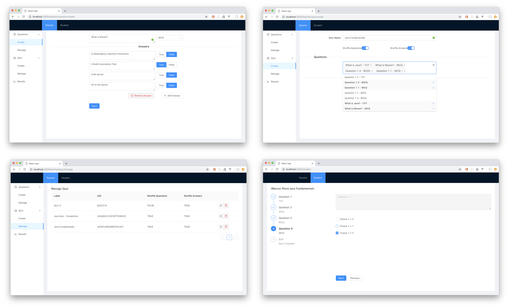

### Quiz App - Java <-> React

##### JAVA Backend API

1. Clone repository `git clone https://github.com/denyoe/quiz.git`
2. Move into the quiz-rest-marcek directory: `cd quiz-rest-marcek`
3. Then: `./mvnw spring-boot:run` to start the server

API BASE URL: `http://127.0.0.1:8080`

QUIZ: `http://127.0.0.1:8080/quiz`

QUESTION: `http://localhost:8080/questions`

##### ReactJS SPA

4. Open another terminal window and move into the client directory which contains the front-end SPA: `cd client`
5. Install the project dependencies with: `yarn install`
6. Launch the client SPA using: `yarn start`

The application is accessible @:

Teacher Views: `http://localhost:3000/teacher/question/manage`
Student Views: `http://localhost:3000/student`
